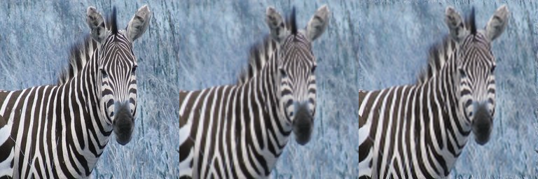
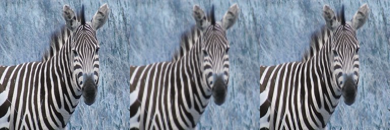

# SRCNN

srcnn demo script for zebra images of horse2zebra(keras version)  
256 * 256 image is cropped as 33*33 (stride 14)

base learning rate 0.0001 for 100 epochs  
next learning rate 0.00003 - 0.00001 - 0.000005 per next 20 epochs  

after 100 epochs, Adam optimizer used

### results

<100 epoch model(original-bicubic-srcnn)>  
  
  

